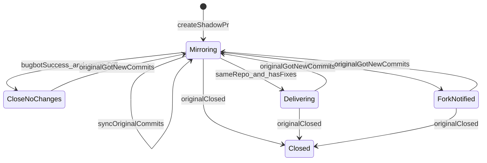

# pr-shadow: 他人のPRを Bugbot 対象にするミラーデーモン

Related issue: https://github.com/Senna46/pr-shadow/issues/1

## 改訂した要件定義

```text
目的:
  Cursor Bugbot（Individual）は Senna46 が作ったPRしかレビューしない。
  他人が開いたPRと同じ差分のミラーPRを Senna46 名義で自動作成し、
  Bugbot + Fixooly 完了後に修正を元PR側へ届ける。

新規リポジトリ:
  GitHub: Senna46/pr-shadow（private）
  ローカル: /Volumes/Samsung980_1TB/github.com/Senna46/pr-shadow
  Fixooly とはコードもデプロイも独立管理。パターンのみ踏襲する。

監視対象:
  Fixooly と同じ GitHub App の installation から自動発見するリポジトリ。

対象PR:
  - 開いているPR
  - 作成者が Senna46 ではない
  - ボット（dependabot 等、login が [bot] で終わるもの）ではない
  - ドラフトではない
  - 自分自身が作ったミラーPRではない
  - フォークPRもミラー対象（届け方だけ別）

ミラーPR:
  - 作成者は必ず Senna46（PAT で pulls.create）。App bot 名義だと Bugbot が走らない
  - ブランチ: pr-shadow/{originalNumber} を base リポジトリへ push
  - base: 元PRと同じ base
  - title: [pr-shadow] #{n}: {元タイトル}
  - body に <!-- PR_SHADOW_ORIGINAL: owner/repo#n --> を埋め込む
  - デフォルトブランチへマージしてはいけない旨を本文に明記する

完了判定（CIのGitHub Actionsは見ない）:
  ミラーPRの最新 HEAD に対する GitHub Check「Cursor Bugbot」が
  conclusion=success（公式: 新規Issueなし、かつ過去の未解決Bugbotコメントなし）

同じリポジトリ内PRの完了後:
  - ミラー HEAD と元 HEAD の差分が空: ミラーPRをマージせずクローズ
  - 差分あり（Fixooly の修正など）: ミラーPRの base を元PRの head ブランチへ変更し、
    元PR作成者を reviewer に指定する

フォークPRの完了後:
  - 差分が空: ミラーPRをクローズ
  - 差分あり: デフォルトブランチへ誤マージしないようミラーPRはクローズ（ブランチは残す）。
    元PRへ修正ブランチと取り込み手順をコメントする。retarget はしない

元PRへの追従:
  - 元PRに Fixooly 以外の追加コミットが来たらミラーブランチへ取り込む
  - コンフリクトは claude -p で解消する（失敗時は停止してPRコメント）
  - すでに届け済み（retarget / フォーク通知 / 差分なしクローズ）でも、
    元が更新されたら再び mirroring に戻して Bugbot をやり直す
  - 元PRが merge/close されたらミラーPRもクローズする

認証:
  - リポジトリ発見: Fixooly と同じ GitHub App（APP_ID + private key）
  - ミラーPR作成・push・レビュー依頼: Senna46 の classic PAT
    （App token だと作者が bot になり Bugbot が動かない。
     push も PAT でないと webhook が飛ばず Bugbot が再実行されない）
```

## なぜこの形か

Bugbot Individual は「自分が作ったPR」だけが対象。GitHub App で PR を作ると作者が `app[bot]` になり、Bugbot は走らない。完了検知は Actions ではなく公式の Check 名 `Cursor Bugbot` の `success` を使う。

## ライフサイクル



- **Mirroring**: base は元PRと同じ。元HEADを取り込み、Bugbot / Fixooly 待ち
- **Delivering**: same-repo。base を元PR head へ変更し、元作者へ review request
- **ForkNotified**: ミラーはクローズ、ブランチは残し、元PRへコメント
- **CloseNoChanges**: ミラーをマージせずクローズ
- 元が再更新されたら Delivering / ForkNotified / CloseNoChanges から **Mirroring へ戻す**

## 技術構成

Fixooly と同じ TypeScript ポーリングデーモン。独立リポジトリとしてパターンのみ踏襲する。

- Node.js >= 18、ESM、`octokit`、`better-sqlite3`、`dotenv`
- 環境変数プレフィックス: `SHADOW_`
- 作業ディレクトリ / DB: `~/.pr-shadow/`
- 単一インスタンス lock、SIGINT/SIGTERM で停止
- Docker + launchd

主要モジュール:

- `src/main.ts` — ポーリングループ
- `src/config.ts` — `SHADOW_*` 読み込み
- `src/githubClient.ts` — App で repo 列挙、PAT で PR 操作 / Check 取得
- `src/state.ts` — SQLite `shadow_prs`
- `src/prMonitor.ts` — 対象PR発見
- `src/shadowManager.ts` — 作成・同期・retarget・クローズ・レビュー依頼
- `src/gitOps.ts` — clone/fetch/merge/cherry-pick
- `src/conflictResolver.ts` — `claude -p` でコンフリクト解消

## 同期とコンフリクト

1. 元 HEAD が前回同期 SHA の子孫なら `git merge` で取り込む
2. force-push で祖先関係が切れたら、ミラー固有コミットを退避し、元 HEAD に reset して cherry-pick
3. コンフリクト時は `claude -p`。失敗したら push せず、PR へエラーコメントして次サイクルで再試行

Git push は Senna46 の PAT（`SHADOW_GITHUB_TOKEN`）。

## 明示的にやらないこと

- Fixooly 本体への機能追加や依存
- GitHub Actions の成功待ち
- フォークPRの retarget / フォークへ push
- ミラーPRをデフォルトブランチへマージすること
