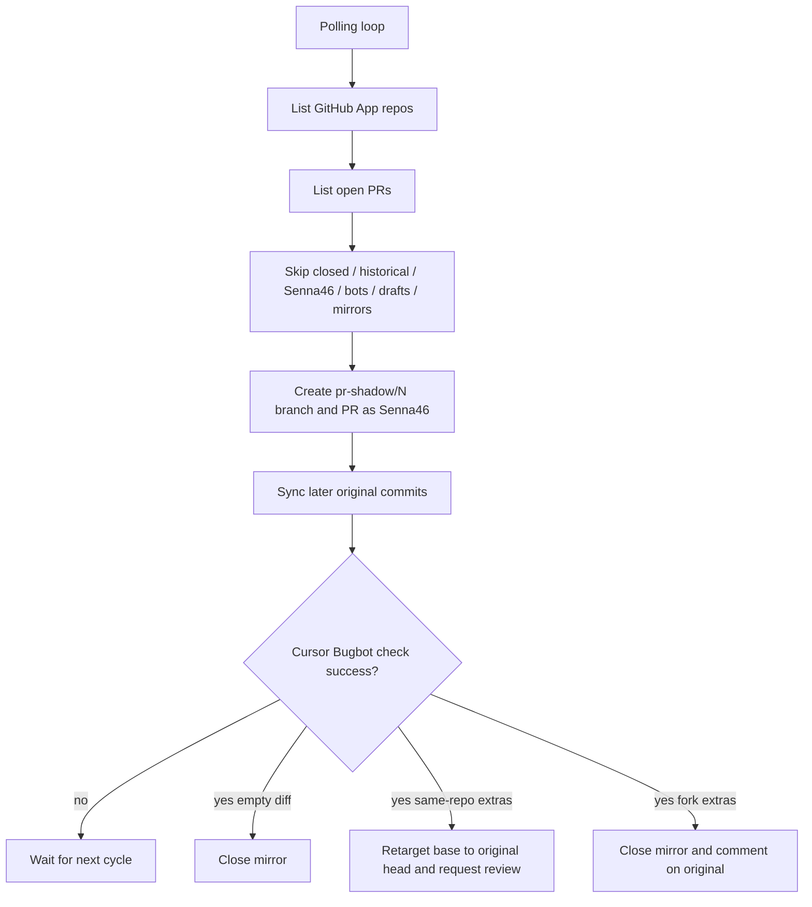

# pr-shadow

Daemon that mirrors other people's GitHub pull requests as Senna46-authored PRs so [Cursor Bugbot](https://cursor.com/docs/bugbot) can review them.

After Bugbot and [Fixooly](https://github.com/Senna46/fixooly) finish with no issues, extra commits are delivered back to the original PR. **Never merge a pr-shadow mirror into a repository default branch.**

## Why this exists

Cursor Bugbot on an Individual plan only reviews pull requests you author. PRs opened by collaborators or from forks are skipped. pr-shadow copies that diff onto a `pr-shadow/{number}` branch, opens a PR as Senna46, and lets Bugbot + Fixooly run there.

## What it does

1. Discovers repositories from the same GitHub App installations as Fixooly
2. For each **open, recently created**, non-draft PR authored by someone other than Senna46, creates a mirror PR. Closed PRs and PRs that were already open before pr-shadow started are ignored, and accidental historical mirrors are closed.
3. Syncs later original commits onto the mirror (resolves conflicts with `claude -p`)
4. Waits until the GitHub check **Cursor Bugbot** is `success` on the mirror HEAD (GitHub Actions is ignored)
5. Then:
   - **No extra commits:** close the mirror
   - **Same-repo PR with extra commits:** change the mirror base to the original head branch and request review from the original author
   - **Fork PR with extra commits:** close the mirror (keep the branch) and comment on the original PR with fetch/merge instructions
6. If the original PR gets more commits after delivery, the mirror returns to mirroring so Bugbot runs again
7. If the original PR is merged or closed, the mirror is closed

## Prerequisites

- The same [GitHub App](https://docs.github.com/en/apps/creating-github-apps) used by Fixooly, installed on the target accounts
- A **classic PAT for Senna46** (`repo` scope). Mirror PRs must be authored by Senna46; App tokens create bot-authored PRs that Bugbot will skip. Push also needs this PAT so webhooks fire.
- `claude` CLI (used only to resolve merge conflicts)
- `git`
- Node.js >= 18, or Docker

## Authentication

### GitHub App (repository discovery)

Reuse Fixooly's App:

- **Repository permissions**: Contents (read & write), Pull requests (read & write), Checks (read)
- Install it on the same organizations/user accounts as Fixooly

### User PAT (mirror authorship)

Set `SHADOW_GITHUB_TOKEN` to a classic PAT for Senna46. This token:

- Creates mirror PRs (author = Senna46)
- Pushes `pr-shadow/*` branches (triggers Bugbot webhooks)
- Requests reviews and posts comments

### Claude Code (conflict resolution)

Same as Fixooly: `CLAUDE_CODE_OAUTH_TOKEN` or `ANTHROPIC_API_KEY`.

## Quick start

```bash
git clone https://github.com/Senna46/pr-shadow.git
cd pr-shadow

npm install
cp .env.example .env
# Set SHADOW_APP_ID, SHADOW_PRIVATE_KEY_PATH, SHADOW_GITHUB_TOKEN

npm run build
npm start

# Development
npm run dev
```

### LaunchAgent on this Mac mini

```bash
npm run build
./deploy/install-daemon.sh
```

Logs: `~/.pr-shadow/logs/stdout.log` and `stderr.log`.

| Action | Command |
| --- | --- |
| Status | `launchctl list \| grep pr-shadow` |
| Stop | `launchctl stop com.senna.pr-shadow` |
| Start | `launchctl start com.senna.pr-shadow` |
| Unload | `launchctl unload ~/Library/LaunchAgents/com.senna.pr-shadow.plist` |

### Docker

```bash
docker compose up -d --build
```

## Configuration

All settings use the `SHADOW_` prefix. See `.env.example`.

Required:

- `SHADOW_APP_ID`
- `SHADOW_PRIVATE_KEY_PATH` or `SHADOW_PRIVATE_KEY`
- `SHADOW_GITHUB_TOKEN`

Optional:

- `SHADOW_AUTHOR_LOGIN` (default `Senna46`)
- `SHADOW_POLL_INTERVAL` (default `120`)
- `SHADOW_MIN_PR_CREATED_AT` (ISO 8601; default: time of the first shadow write, so already-open historical PRs are ignored)
- `SHADOW_WORK_DIR` (default `~/.pr-shadow/repos`)
- `SHADOW_DB_PATH` (default `~/.pr-shadow/state.db`)
- `SHADOW_CLAUDE_MODEL`
- `SHADOW_LOG_LEVEL`

## Architecture



## Safety

- Mirror PRs are titled `[pr-shadow] #N: ...` and include `<!-- PR_SHADOW_MANAGED -->`
- The daemon never merges a mirror into `main` / `master`
- Fork mirrors with fixes are closed so they cannot be merged into the default branch by accident
- Closed PRs are never mirrored. Already-open historical PRs are not backfilled; accidental mirrors of those PRs are closed.
