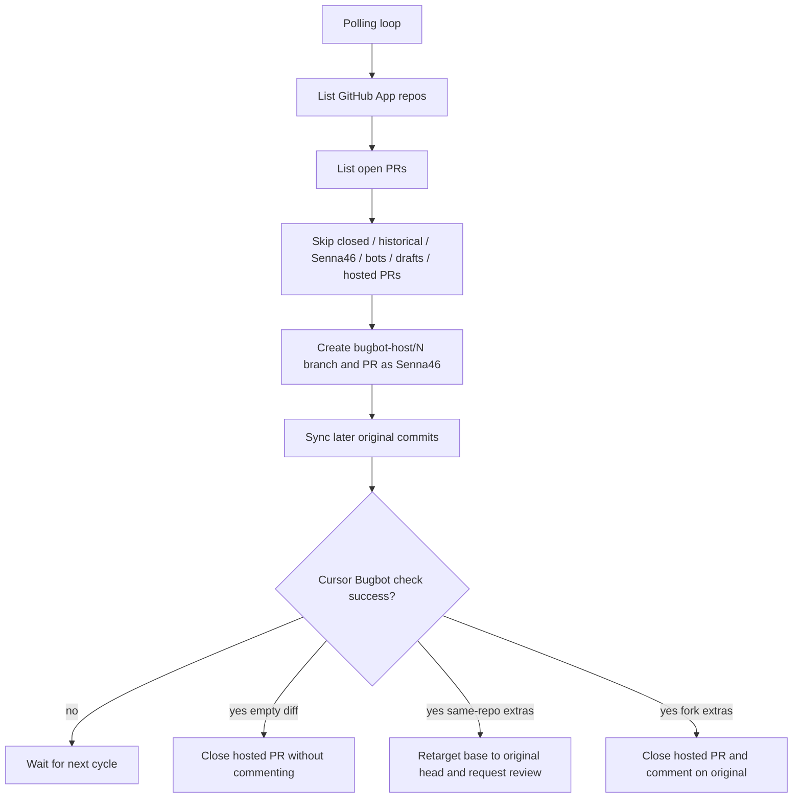

# bugbot-host

Daemon that hosts other people's GitHub pull requests as Senna46-authored PRs so [Cursor Bugbot](https://cursor.com/docs/bugbot) can review them.

When Bugbot finds issues and [Fixooly](https://github.com/Senna46/fixooly) commits fixes, those commits are delivered back to the original PR. A clean Bugbot result closes the hosted PR without commenting on the original. **Never merge a bugbot-host PR into a repository default branch.**

Formerly named pr-shadow. Existing `pr-shadow/*` branches and `PR_SHADOW_*` markers are still recognized so old hosted PRs are not processed twice.

## Why this exists

Cursor Bugbot on an Individual plan only reviews pull requests you author. PRs opened by collaborators or from forks are skipped. bugbot-host copies that diff onto a `bugbot-host/{number}` branch, opens a PR as Senna46, and lets Bugbot + Fixooly run there.

## What it does

1. Discovers repositories from the same GitHub App installations as Fixooly
2. For each **open, recently created**, non-draft PR authored by someone other than Senna46, creates a hosted PR. Closed PRs, PRs that were already open before bugbot-host started, and repositories listed in `BUGBOT_HOST_EXCLUDED_REPOS` are ignored. Accidental historical hosted PRs are closed.
3. Syncs later original commits onto the hosted branch (resolves conflicts with `claude -p`)
4. Waits until the GitHub check **Cursor Bugbot** is `success` on the hosted HEAD (GitHub Actions is ignored)
5. Then:
   - **No extra commits:** close the hosted PR. Do not comment on the original PR
   - **Same-repo PR with extra commits:** change the hosted PR base to the original head branch, request review from the original author, and comment once on the original PR
   - **Fork PR with extra commits:** close the hosted PR (keep the branch) and comment on the original PR with fetch/merge instructions
6. If the original PR gets more commits after delivery, hosting returns so Bugbot runs again
7. If the original PR is **merged** while Bugbot reported issues or fix commits exist, leave the hosted PR open and do not comment. If Bugbot is clean and there are no fix commits, close the hosted PR without commenting. If the original PR is **closed without merging**, close the hosted PR without commenting

## Prerequisites

- The same [GitHub App](https://docs.github.com/en/apps/creating-github-apps) used by Fixooly, installed on the target accounts
- A **classic PAT for Senna46** (`repo` scope). Hosted PRs must be authored by Senna46; App tokens create bot-authored PRs that Bugbot will skip. Push also needs this PAT so webhooks fire.
- `claude` CLI (used only to resolve merge conflicts)
- `git`
- Node.js >= 18, or Docker

## Authentication

### GitHub App (repository discovery)

Reuse Fixooly's App:

- **Repository permissions**: Contents (read & write), Pull requests (read & write), Checks (read)
- Install it on the same organizations/user accounts as Fixooly

### User PAT (hosted PR authorship)

Set `BUGBOT_HOST_GITHUB_TOKEN` to a classic PAT for Senna46. This token:

- Creates hosted PRs (author = Senna46)
- Pushes `bugbot-host/*` branches (triggers Bugbot webhooks)
- Requests reviews and posts comments

### Claude Code (conflict resolution)

Same as Fixooly: `CLAUDE_CODE_OAUTH_TOKEN` or `ANTHROPIC_API_KEY`.

## Quick start

```bash
git clone https://github.com/Senna46/bugbot-host.git
cd bugbot-host

npm install
cp .env.example .env
# Set BUGBOT_HOST_APP_ID, BUGBOT_HOST_PRIVATE_KEY_PATH, BUGBOT_HOST_GITHUB_TOKEN

npm run build
npm start

# Development
npm run dev
```

### macOS LaunchAgent

```bash
npm run build
./deploy/install-daemon.sh
```

Logs: `~/.bugbot-host/logs/stdout.log` and `stderr.log`.

| Action | Command |
| --- | --- |
| Status | `launchctl list \| grep bugbot-host` |
| Stop | `launchctl stop com.senna.bugbot-host` |
| Start | `launchctl start com.senna.bugbot-host` |
| Unload | `launchctl unload ~/Library/LaunchAgents/com.senna.bugbot-host.plist` |

### Docker

```bash
docker compose up -d --build --remove-orphans
```

`--remove-orphans` is required after the pr-shadow -> bugbot-host rename so an existing `pr-shadow` container (renamed service/volume) is stopped instead of continuing to run alongside the new one and double-hosting PRs.

## Configuration

All settings use the `BUGBOT_HOST_` prefix. Former `SHADOW_*` names are still accepted. See `.env.example`.

Required:

- `BUGBOT_HOST_APP_ID`
- `BUGBOT_HOST_PRIVATE_KEY_PATH` or `BUGBOT_HOST_PRIVATE_KEY`
- `BUGBOT_HOST_GITHUB_TOKEN`

Optional:

- `BUGBOT_HOST_AUTHOR_LOGIN` (default `Senna46`)
- `BUGBOT_HOST_POLL_INTERVAL` (default `120`)
- `BUGBOT_HOST_MIN_PR_CREATED_AT` (ISO 8601; default: the first time this cutoff code runs, so already-open historical PRs are ignored)
- `BUGBOT_HOST_WORK_DIR` (default `~/.bugbot-host/repos`)
- `BUGBOT_HOST_DB_PATH` (default `~/.bugbot-host/state.db`)
- `BUGBOT_HOST_CLAUDE_MODEL`
- `BUGBOT_HOST_LOG_LEVEL`
- `BUGBOT_HOST_EXCLUDED_REPOS` (comma-separated `owner/repo`; those repositories are not scanned. Remove a name to host it again)

## Architecture



## Safety

- Hosted PRs are titled `[bugbot-host] #N: ...` and include `<!-- BUGBOT_HOST_MANAGED -->`
- The daemon never merges a hosted PR into `main` / `master`
- Fork hosted PRs with fixes are closed so they cannot be merged into the default branch by accident
- Closed PRs are never hosted. Already-open historical PRs are not backfilled; accidental hosted PRs of those originals are closed.

## Related projects

- [Fixooly](https://github.com/Senna46/fixooly) — auto-fix Cursor Bugbot findings with Claude Code
- [refactory](https://github.com/Senna46/refactory) — weekly behavior-preserving cleanup PRs

## License

MIT
